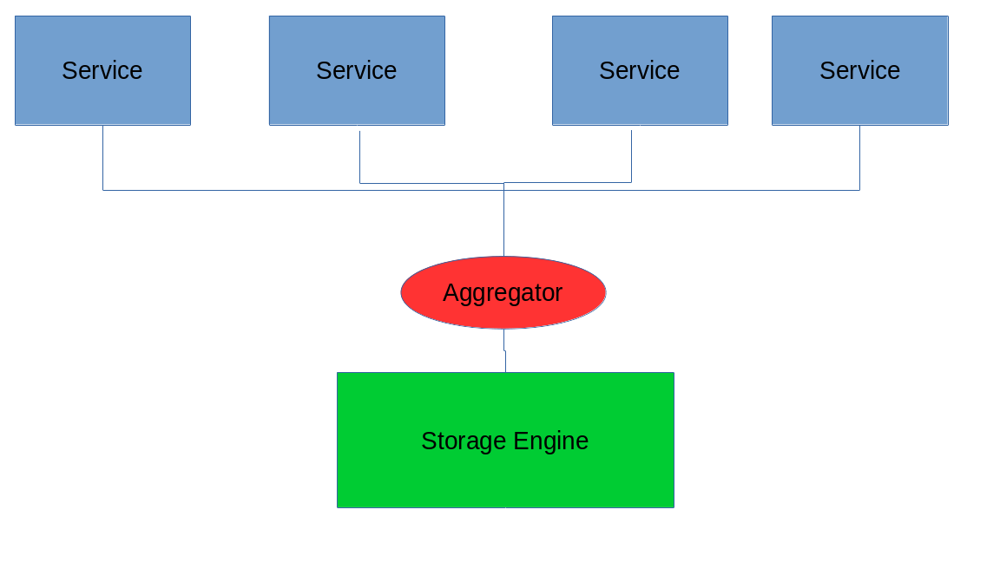
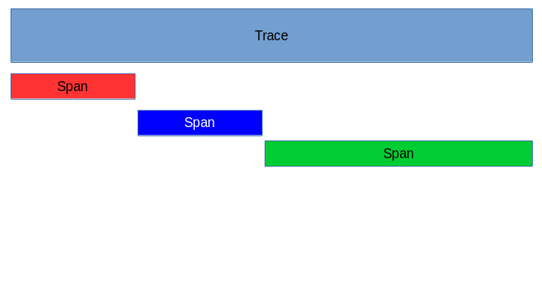

# Distributed Tracing

When your application becomes larger than one process, you're going to have a harder time determining what's going on.

In chapter [Writing Scalable Services](../scalablesvcs/README.md) we discussed how to monitor a single service.  Now we'll see how to tie the events and metrics from different machines and services into usable information.

# End-to-end visibility into distributed applications

With a distributed tracing system in place, you can have end-to-end visibility into your processes, even when they span multiple services on separate hosts.

A distributed tracing system requires plumbing in your application, and requires some ancillary services/infrastructure to enable distributed capture of events and metrics.

# Tying distributed requests together
 
In order to correlate a single event across different systems the event must be tagged with a unique identifier.

Distributed tracing systems have common terminology for these events:

Trace:  A single end-to-end event.
- Website request

Span:  One portion of a trace
- HTTP Handler
- Database retrieval
- User Auth Function

## Generating unique request identifiers

In a distributed system, it's more challenging to uniquely identify a request because there are so many connected systems.  Often extremely large networks will use a unique identification generation service.  These services are specially designed to prevent ID collisions.

Examples:
- Snowflake -Twitter
- Noeqd -Heroku

These services require very specific care when you're setting them up. Misconfiguration will cause collisions.

# Building a distributed trace service

A DT service consists of at least two components:

- Aggregation server(s)
- Storage system

## Aggregation server

The Aggregation server accepts network calls from services reporting trace and span collections.  It's responsible for collecting the spans reported across the system and `aggregating` them together to form a single trace.

## Storage System

Some distributed tracing systems will allow you to run collection storage "in-memory" which is fine for development, but pointless in production.  Every system supports different storage engines, but common options are:

- Time series databases like InfluxDB
- Regular databases (mysql/postgres/etc)
- Kafka

# OpenTracing

OpenTracing is a relatively new standard for the instrumentation of applications.  Any application that is instrumented with an OpenTracing compatible library can use any backend that is capable of receiving OT collections.

_Recommendation_: 

	Use OpenTracing to instrument your distributed application.

## LightStep

Lightstep is a new commercial offering that accepts OpenTracing collections and displays them in a nice dashboard.  When I last used it (fall 2016) it was fast and reliable, but their Go instrumentation library still needed some tweaking.

[lightstep](http://lightstep.com)

## Appdash 

Appdash is an open source tracing system written by Source Graph.  It is easy to run and is also written in Go.

[appdash](https://github.com/sourcegraph/appdash)

## Zipkin

Zipkin is the original open source tracing service.

It's written for the JVM and is "heavier" than the other options, as it requires more infrastructure to support.

[zipkin](http://zipkin.io)

## Recommendation

Start with Appdash, using the OpenTracing instrumentation libraries.  Unless you reach insane traffic levels, that's likely to be all you need.

- github.com/bketelsen/trace was conceived as a response to the ugliness that litters a function when you have monitoring, metrics and logging.  It is an adaptation of a similar pattern I wrote at Backplane.io which wrapped OpenTracing, shipping to LightStep.  If every function has a span, then it becomes easy for every function to log and collect timing metrics too.  The pattern allows you to have fewer lines of code to achieve the same results.

When I have time (Pull Requests accepted!) I'm going to add an OpenTracing back-end option to `bketelsen/trace`

# Exercise

Run appdash in demo mode.

	go get -u github.com/sourcegraph/appdash/cmd/appdash

	appdash demo

Look at the source for the demo application

	src/github.com/sourcegraph/appdash/cmd/appdash/example_app.go
